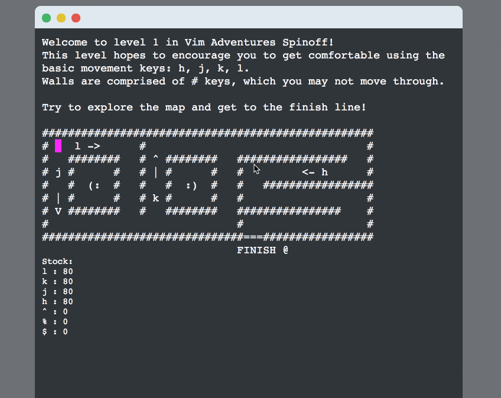
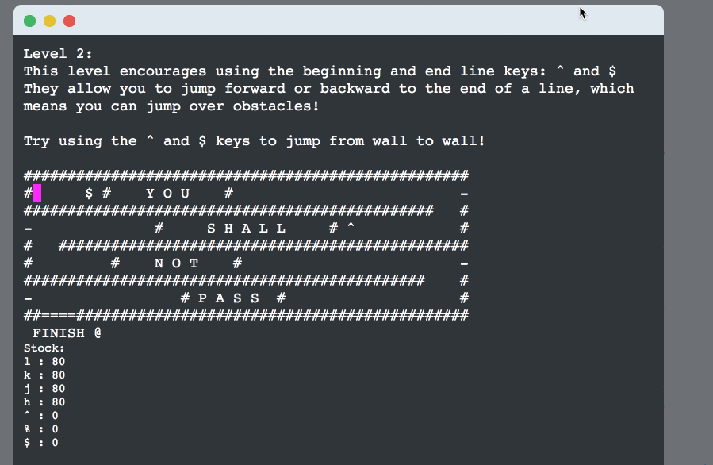

# Vim Adventures in Elm

A [Vim Adventures](https://vim-adventures.com) spinoff in Elm!

## About

This game was created entirely using [**Elm**](http://elm-lang.org), a purely functional language used to declaratively create web interfaces. We chose Elm for this prototype to explore its language features, such as immutability, [static type checking](https://elm-lang.org/blog/compilers-as-assistants), [type inference](https://groups.google.com/forum/#!topic/elm-discuss/NVoWA0ZYZNM), union types, and [error handling mechanisms](https://guide.elm-lang.org/error_handling/). While similar to Haskell in many ways, unlike Haskell or even PureScript, Elm has no support for [user-defined typeclasses](http://reasonablypolymorphic.com/blog/elm-is-wrong/).

The game was completed as a part of [CPSC 311: Definition of Programming Languages](https://www.ugrad.cs.ubc.ca/~cs311/current/_goals.php) at the University of British Columbia.

## Demo

Try it [**here**](https://mi-lee.github.io/vim-adventures-in-elm/)!

## Game Features

Implemented Vim keybindings include:

- Character navigation (`h` `j`, `k`, `l`)
- Line navigation (`^`, `$`)
- Navigation to matching parenthesis (`%`)
- Functional operators for the above

The game also includes:

- Obstructions: Vim navigation commands will not work against maze obstructions.
- "Stock supply": which limits the number of times the user may use each command (and replenish the supply if the user picks up more)
- Automatic level progression
- Sound effects

The game is over if you run out of Vim command "stock" before you reach the finish line!

## Installation

To install Elm, follow the instructions on Elm's documentation [here](https://guide.elm-lang.org/install.html). This project uses Elm v0.19.0 and various dependencies, listed [here](https://github.com/mi-lee/vim-adventures-in-elm-cs311-project/blob/master/elm.json).

To install the dependencies, run `elm install`.

To build the game locally, run `elm reactor` in the correct directory, and navigate to `Main.elm` on your localhost:8000.

